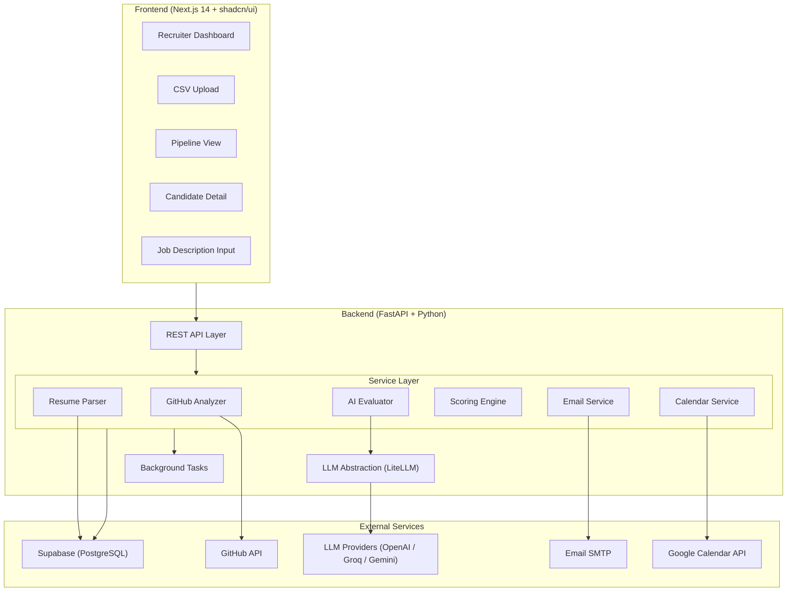
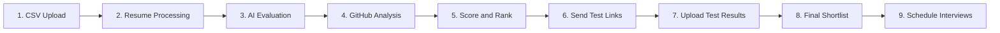

# AI-Powered Candidate Screening Platform

## Architecture Overview



## Pipeline Stages



Each candidate tracks their current pipeline stage. The recruiter dashboard shows aggregate counts and allows drill-down per stage.

---

## Tech Stack

| Layer | Technology | Rationale |
|-------|-----------|-----------|

- **Frontend**: Next.js 14 (App Router) + Tailwind CSS + shadcn/ui -- modern React, great DX, free Vercel hosting
- **Backend**: FastAPI (Python 3.11+) -- async, type-safe, native for AI/ML workloads
- **Database**: Supabase PostgreSQL -- real-time subscriptions, auth, storage, free tier
- **LLM**: LiteLLM (unified interface to OpenAI / Groq / Gemini) -- swap providers via env var
- **Embeddings**: OpenAI `text-embedding-3-small` (or Sentence Transformers as fallback)
- **Email**: SMTP via Gmail App Password (assignment says "use own email service")
- **Calendar**: Google Calendar API with OAuth2 service account
- **Hosting**: Vercel (frontend) + Railway (backend, recommended for easy Python Docker deploys)

---

## Project Structure

```
visl-ai-assignment/
├── backend/
│   ├── app/
│   │   ├── main.py                    # FastAPI app, CORS, lifespan
│   │   ├── config.py                  # Pydantic Settings (env vars)
│   │   ├── database.py                # Supabase client + SQLAlchemy engine
│   │   ├── models/
│   │   │   ├── candidate.py           # Candidate ORM model
│   │   │   ├── job.py                 # Job posting model
│   │   │   ├── evaluation.py          # Evaluation results model
│   │   │   └── interview.py           # Interview scheduling model
│   │   ├── schemas/                   # Pydantic request/response schemas
│   │   ├── api/
│   │   │   ├── jobs.py                # POST /jobs, GET /jobs
│   │   │   ├── candidates.py          # POST /candidates/upload, GET /candidates
│   │   │   ├── evaluations.py         # POST /evaluations/run, GET /evaluations
│   │   │   ├── tests.py               # POST /tests/upload-results
│   │   │   └── interviews.py          # POST /interviews/schedule
│   │   ├── services/
│   │   │   ├── resume_service.py      # Download from GDrive, extract text (PyPDF2/pdfplumber)
│   │   │   ├── github_service.py      # GitHub API: repos, commits, languages, stars
│   │   │   ├── evaluation_service.py  # LLM-based candidate eval + embeddings
│   │   │   ├── scoring_engine.py      # Z-score, cosine sim, decay, weighted sum
│   │   │   ├── email_service.py       # SMTP email with test links
│   │   │   └── calendar_service.py    # Google Calendar + Meet link generation
│   │   └── core/
│   │       ├── llm.py                 # LiteLLM wrapper with structured output
│   │       └── embeddings.py          # Embedding generation abstraction
│   ├── requirements.txt
│   ├── Dockerfile
│   └── .env.example
├── frontend/
│   ├── src/
│   │   ├── app/
│   │   │   ├── page.tsx               # Dashboard home
│   │   │   ├── layout.tsx             # Root layout with sidebar
│   │   │   ├── jobs/
│   │   │   │   ├── page.tsx           # List jobs
│   │   │   │   ├── new/page.tsx       # Create job + JD input
│   │   │   │   └── [id]/page.tsx      # Job detail + pipeline
│   │   │   ├── candidates/
│   │   │   │   ├── page.tsx           # Candidate list with filters
│   │   │   │   └── [id]/page.tsx      # Candidate detail + score breakdown
│   │   │   └── pipeline/
│   │   │       └── [jobId]/page.tsx   # Kanban-style pipeline view
│   │   ├── components/
│   │   │   ├── ui/                    # shadcn/ui components
│   │   │   ├── dashboard/             # Dashboard widgets
│   │   │   ├── candidates/            # Candidate cards, tables, score charts
│   │   │   └── pipeline/              # Pipeline stage columns
│   │   └── lib/
│   │       ├── api.ts                 # Backend API client (fetch wrapper)
│   │       └── utils.ts
│   ├── package.json
│   ├── tailwind.config.ts
│   └── next.config.js
├── docs/
│   └── architecture.md                # Required deliverable
└── README.md
```

---

## Database Schema (Supabase PostgreSQL)

```sql
-- Core tables
jobs (id, title, description, weight_config JSONB, created_at)
candidates (id, job_id FK, s_no, name, email, college, branch, cgpa,
            best_ai_project, research_work, github_url, resume_url,
            resume_text, pipeline_stage, created_at)
evaluations (id, candidate_id FK, job_id FK,
             resume_score, project_score, research_score,
             github_score, jd_match_score,
             explanation JSONB, created_at)
scores (id, candidate_id FK, job_id FK,
        cgpa_z, test_la_z, test_code_z,
        semantic_score, github_score, composite_score,
        rank, score_breakdown JSONB)
test_results (id, candidate_id FK, test_la, test_code, uploaded_at)
interviews (id, candidate_id FK, job_id FK,
            scheduled_at, google_meet_link, calendar_event_id,
            status, created_at)
email_logs (id, candidate_id FK, email_type, sent_at, status)
```

---

## Scoring Engine (Mathematical Framework)

Incorporating and extending the plan from [Building a Candidate Screening Engine.md](prd/Building a Candidate Screening Engine.md):

### Dimension 1: Semantic Similarity (text fields vs JD)
- Embed `best_ai_project`, `research_work`, and parsed `resume_text` using an embedding model
- Embed the job description
- Compute cosine similarity for each, producing scores in [0, 1]
- Formula: `sim = dot(A, B) / (norm(A) * norm(B))`

### Dimension 2: Z-Score Normalization (numeric fields)
- For `cgpa`, `test_la`, `test_code`: compute mean and stddev across the candidate pool
- Z-score: `Z = (X - mu) / sigma`
- Convert to percentile via normal CDF to get [0, 1]
- Recalculated dynamically when new data is uploaded

### Dimension 3: GitHub Impact Score (exponential decay)
- Fetch top repos via GitHub API (stars, forks, languages, last commit date)
- Per-repo impact: `I = (stars + w * forks) * exp(-lambda * days_since_commit)`
- Sum top-N repo scores, normalize to [0, 1] across pool
- Bonus: language relevance to JD (e.g., Python repos for an ML role)

### Dimension 4: LLM Qualitative Evaluation
- Prompt the LLM with candidate profile + JD, request structured JSON output
- Dimensions: technical depth, project complexity, research quality, JD alignment
- Each dimension scored 0-10 with natural language justification
- Normalized to [0, 1]

### Final Composite Score
- Weighted sum: `U = sum(w_i * x_i)` where weights are recruiter-configurable
- Default weights: `{jd_match: 0.25, github: 0.20, test_code: 0.20, test_la: 0.10, project: 0.10, research: 0.05, cgpa: 0.10}`
- Rank candidates by composite score descending

---

## Key Implementation Details

### Resume Processing
- Parse Google Drive links to extract file IDs
- Download via `https://drive.google.com/uc?export=download&id={file_id}`
- Extract text using `pdfplumber` (handles layout better than PyPDF2)
- Store extracted text in `candidates.resume_text`

### GitHub Analysis
- Use GitHub REST API (unauthenticated: 60 req/hr; with token: 5000 req/hr)
- Extract username from profile URL
- Fetch: `/users/{username}/repos?sort=updated&per_page=10`
- Per repo: stars, forks, language, updated_at, description
- Apply exponential decay formula from the scoring plan

### Google Calendar Integration
- Use Google Calendar API with a service account (or OAuth2 installed app flow)
- Create event with `conferenceData` to auto-generate Google Meet link
- Set attendees to candidate email + recruiter email
- Store event ID for potential rescheduling

### Email Service
- Use Python `smtplib` with Gmail SMTP (`smtp.gmail.com:587`)
- Requires Gmail App Password (not regular password)
- Templates for: test link notification, interview invitation (with Meet link)

### LLM Abstraction via LiteLLM
- Single `completion()` call that routes to any provider
- Switch provider via `LITELLM_MODEL` env var (e.g., `gpt-4o-mini`, `groq/llama-3.1-70b`, `gemini/gemini-1.5-flash`)
- Use JSON mode for structured evaluation outputs

---

## Frontend Highlights (Bonus: Recruiter Dashboard)

- **Dashboard Home**: Pipeline funnel chart, candidate count by stage, recent activity feed
- **Job Creation**: Rich text JD input with weight sliders for scoring dimensions
- **Candidate Table**: Sortable/filterable table with inline score badges, pipeline stage chips
- **Candidate Detail**: Radar chart of scores, LLM explanation cards, GitHub repo cards, resume viewer
- **Pipeline View**: Kanban board with drag-drop (visual, not functional drag) showing candidates per stage
- **Score Breakdown**: Expandable panels showing exact math (Z-scores, cosine similarities, decay values)

---

## Deployment

- **Frontend**: `vercel deploy` (auto-detects Next.js, free hobby tier)
- **Backend**: Railway with Dockerfile (auto-deploy from GitHub, $5 free credit)
- **Database**: Supabase free tier (500MB, 50K monthly active users)
- **Environment**: All secrets via env vars, `.env.example` provided

---

## Deliverables Checklist

- Hosted application (Vercel + Railway URLs)
- GitHub repository with README and setup instructions
- Architecture document (`docs/architecture.md`) explaining system design and AI approach
- Demo video script covering the full workflow (5-10 min)
